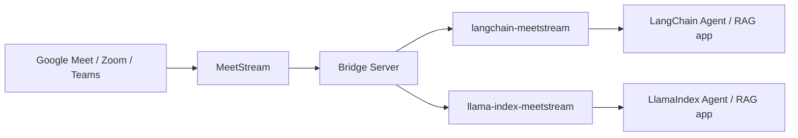

# Architecture

This document is the detailed technical companion to the root [README.md](../README.md).
It exists so that someone (including a future version of the original author) can open
this repository after months away and reconstruct *why* it looks the way it does, not
just *what* it does.

## 1. System boundaries

There are four independently-versioned things in this repository:

1. **`bridge/`** — a FastAPI service that is the *only* thing in this repository that
   talks to the real MeetStream REST API. It owns authentication, request shaping,
   response normalization, and error mapping.
2. **`packages/langchain-meetstream/`** — a pip-installable package (`langchain_meetstream`)
   that talks to the bridge over HTTP and exposes LangChain-native `Document` loading and
   `BaseTool` objects.
3. **`packages/llama-index-meetstream/`** — the LlamaIndex equivalent (`llama_index_meetstream`),
   talking to the same bridge contract.
4. **MeetStream itself** — external, out of process, reached only from `bridge/`.



Nothing in `bridge/` imports `langchain` or `llama_index`. Nothing in the two framework
packages imports the bridge's Python code — they only know its HTTP contract (base URL +
JSON in/out). This is enforced by packaging, not just convention: `bridge/pyproject.toml`
does not list either framework as a dependency, and the framework packages depend on
`httpx`/`pydantic`, not on `bridge`.

**Why a bridge at all, instead of each framework package calling MeetStream directly?**
Two independent, hand-written MeetStream clients already existed on this machine before
this project (see §3) and had already drifted from each other in small but real ways
(different endpoint paths for the same operation, different retry policies, one with a
stale/incorrect guess at an endpoint). Duplicating that logic a *third and fourth* time,
once per framework package, would only grow that drift. Centralizing it means a MeetStream
API change is a one-file fix in `bridge/app/clients/meetstream.py`, not a two-package,
two-language hunt.

## 2. Why standalone packages, not upstream contributions

`langchain-meetstream` and `llama-index-meetstream` are shipped as their own PyPI-style
packages rather than PRs into the `langchain` or `llama_index` monorepos, because:

- MeetStream is a third-party product with its own release cadence and API surface; the
  LangChain/LlamaIndex core teams have no way to validate or maintain integration code for
  it, which is exactly why both projects' current contribution guidelines steer
  provider-specific integrations toward standalone, independently-versioned packages
  (`langchain-<provider>`, `llama-index-<provider>`) rather than the core repo.
- It lets this repo version and release independently of both frameworks' release trains.
- It keeps the bridge — which is the part with any real business logic — entirely
  framework-agnostic and reusable by anything that can speak HTTP, not just Python.

## 3. What existed before this repository (the real MeetStream API contract)

This repository started **empty** — there was no prior code, README, OpenAPI spec, or
tests inside it to inherit. However, three *other*, unrelated local projects on this
machine (found by searching `~/development` for "meetstream") each contain independently
written, hand-tested MeetStream API clients:

| Project | Language | What it confirmed |
|---|---|---|
| `~/development/meetstream-gameshow-host/app/meetstream/rest_client.py` | Python (httpx) | `POST /bots/create_bot`, `GET /bots/{id}/status`, `GET /bots/{id}/remove_bot`, `POST /bots/{id}/send_message`, `POST /bots/{id}/send_image`, `GET /bots/{id}/get_chats`, `Authorization: Token <key>` header, live-tested 503 retry behavior |
| `~/development/meetstream-minutes/lib/meetstream/{client,types}.ts` | TypeScript | Same `status`/`remove_bot` endpoint shapes (independent second confirmation), plus `GET /bots/{id}/transcriptions` returning a **list of transcription jobs**, each with a `status` and `download_urls.{raw_transcript,processed_transcript}` — i.e. the transcript is not returned inline, it's a link to a file that must be separately fetched |
| `~/development/meeting_digital_twin/src/meetstream_client.py` | Python (requests) | A third, less-corroborated implementation. Its `/bots/{id}/transcription` (singular) and `DELETE /bots/{id}` guesses **conflict** with the two sources above and are treated as unconfirmed/likely-stale rather than authoritative. |


**Live-verified correction (2026-09-10):** this bridge was run end-to-end against a real
MeetStream account and a real Google Meet meeting (dispatch → join → leave → transcript
fetch), the only point in this project where real MeetStream responses (not a reference
implementation's assumption about them) were directly observed. Two corrections came out
of that run: dispatch-time `status` is `"Active"`, not the `"joining"` example value
several docstrings/examples had assumed (harmless either way, since `status` is passed
through raw either way — only the illustrative docstring examples were wrong, now fixed);
and `GET /bots/{id}/remove_bot`'s real response is `{bot_id, status, bot_status,
control_request_id, requested_at, acknowledged_at, completed_at}` with **no `message`
field**, contradicting `meetstream-minutes`' `RemoveBotResponse {message: string}` type —
`app/services/bot_service.py`'s `leave_meeting` branch now reads `status` instead. The
transcript fetch itself (`get_transcriptions` → download `processed_transcript` → parse)
worked exactly as designed against real data, including real `speaker`/`start_time`/
`end_time` fields in the shape this project's defensive parser expected.

**Explicit gap: no confirmed "meeting metadata" endpoint.** All three reference
implementations are organized entirely around a **bot**, not an independent "meeting"
resource. There is no MeetStream endpoint in any of them that returns a meeting title,
platform, or start/end timestamps by ID. See §6 for how the bridge handles this honestly
rather than inventing fields.

**Explicit gap: no confirmed transcript segment schema.** `GET /bots/{id}/transcriptions`
only returns metadata about transcription *jobs* plus a `download_urls.processed_transcript`
link — none of the three reference projects actually fetches and parses that file's
contents. The per-segment shape (`text` / `speaker` / `start_time` / `end_time`) requested
by this project's spec is MeetStream's documented conceptual shape, but not something any
local, live-tested code could confirm byte-for-byte. `bridge/app/services/transcript_service.py`
therefore parses the downloaded transcript defensively (accepting a few plausible key
names, matching the same defensive approach `meeting_digital_twin/src/transcript_utils.py`
already independently arrived at) and raises a typed `TranscriptFormatError` — never
silently fabricated data — if the downloaded content doesn't match any recognized shape.

## 4. Bridge responsibilities

`bridge/app/clients/meetstream.py` is the **only** module that constructs MeetStream URLs,
sets the `Authorization: Token <key>` header, or knows MeetStream's raw JSON field names.
Everything above it works with typed Pydantic models (`bridge/app/models/`).

`bridge/app/services/` sits between the raw client and the HTTP API layer and does the
actual normalization:

- `bot_service.py` — dispatches a bot (`POST /bots`), gets bot/meeting status.
- `meeting_service.py` — builds the best available "meeting metadata" view from bot status,
  being explicit about which fields MeetStream does not provide (see §6).
- `transcript_service.py` — polls the transcription-job list, downloads
  `processed_transcript` once a job's `status` is `Success`, and parses it into
  `TranscriptSegment` objects.

`bridge/app/exceptions.py` defines one error taxonomy (`MeetStreamAuthError`,
`MeetingNotFoundError`, `BotNotFoundError`, `InvalidMeetingURLError`,
`TranscriptNotReadyError`, `TranscriptUnavailableError`, `UnsupportedPlatformError`,
`UpstreamError`, `UpstreamTimeoutError`) that every route maps to a consistent JSON error
body (`{"error": {"code": ..., "message": ...}}`) with an appropriate HTTP status. No raw
MeetStream response body, stack trace, or API key ever reaches that JSON body or the logs.

## 5. Framework package responsibilities

Both `langchain_meetstream` and `llama_index_meetstream` follow the same internal shape:

- `client.py` — a small, synchronous `httpx`-based `MeetStreamClient` that talks to the
  **bridge's** HTTP contract (not MeetStream's). Reads `MEETSTREAM_API_KEY` and
  `MEETSTREAM_BRIDGE_URL` from the environment as defaults. This client is intentionally
  shared between the loader/reader and the tools *within* each package — see the note in
  §8 about why that's the right call here even though an earlier, pre-bridge prototype in
  this same repo path had explicitly rejected a shared client.
- `document_loaders/meetstream.py` / `readers/meetstream.py` — turns one bridge transcript
  response into a list of framework-native `Document` objects, one per transcript segment.
- `tools/` — framework-native tool objects wrapping the same four bridge operations
  (dispatch, get meeting, get transcript, meeting action).
- `exceptions.py` — thin, framework-local exception types raised from the bridge's HTTP
  error responses, so a caller catching `langchain_meetstream.MeetStreamAPIError` never
  needs to know this is backed by an HTTP call at all.

Neither package re-implements retry/backoff/auth logic against the *real* MeetStream API —
that only exists once, in the bridge.

## 6. Meeting metadata: what's real vs. derived vs. unavailable

Because MeetStream's real API (per §3) has no meeting-title/platform/timestamp endpoint,
`GET /meetings/{meeting_id}` on the bridge returns:

| Field | Source | Notes |
|---|---|---|
| `meeting_id` | Echoed input | See "meeting_id vs bot_id" below. |
| `status` | `GET /bots/{id}/status` → `status` | Passed through as MeetStream reports it (e.g. `"InMeeting"`), not remapped to an invented enum. |
| `platform` | **Derived**, not from MeetStream | Inferred from the meeting URL's hostname (`meet.google.com` → `google_meet`, `zoom.us` → `zoom`, `teams.microsoft.com` → `teams`) by `bridge/app/services/meeting_service.py::infer_platform`. `None` if the URL isn't known (see next row) or doesn't match a known host. |
| `meeting_url` | Only known at dispatch time | The bridge is stateless (no database — see §9); `create_bot`'s response is the only point at which a meeting URL is confirmed. `GET /meetings/{id}` called later, in a separate process, has no way to recover it from MeetStream's status endpoint alone (which doesn't return it) and returns `None`. Document this to users as a real limitation, not a bug. |
| `title` | **Not available** | No source confirms MeetStream exposes a meeting/bot title anywhere. Always `None`. `TODO: MeetStream API currently does not expose a meeting title field.` |
| `started_at` / `ended_at` | **Not available synchronously** | Only present in *webhook* lifecycle events (`bot.inmeeting`, `bot.stopped` timestamps), which this bridge does not currently ingest or persist (see §10). Always `None` from `GET /meetings/{id}`. `TODO: requires webhook ingestion + storage, out of scope for v0.1.` |

**`meeting_id` vs `bot_id`.** MeetStream's real API has no meeting identifier independent
of the bot instance that joined it — one bot join *is* one meeting session, identified by
`bot_id`. This project's public API (and the original task spec) is written in terms of
`meeting_id` because that's the vocabulary application developers think in. The bridge
treats these as the same value: `meeting_id` in every bridge request/response *is*
MeetStream's `bot_id`. This is a naming/vocabulary adapter, not a different resource.

## 7. Transcript normalization

```
GET /bots/{bot_id}/transcriptions        (MeetStream — list of transcription jobs)
        │
        ▼
pick the newest job; if status != "Success", raise TranscriptNotReadyError / TranscriptUnavailableError
        │
        ▼
GET <download_urls.processed_transcript> (MeetStream — the actual transcript file)
        │
        ▼
parse into TranscriptSegment[] (text, speaker, start_time, end_time) — defensive, see §3
        │
        ▼
bridge response: {"meeting_id", "segments": [...]}
```

The bridge deliberately stops at *segment* granularity — it does not run any further
chunking (character splitting, token windowing, etc.) on top of MeetStream's own turns.
That's a framework-layer concern; see §5 and the RAG examples in each package, which show
piping bridge segments through `RecursiveCharacterTextSplitter` (LangChain) or a
`SentenceSplitter`/`IngestionPipeline` (LlamaIndex) only if a user's documents are large
enough to want it.

## 8. Shared client decision (langchain_meetstream / llama_index_meetstream)

An earlier, pre-bridge prototype that lived at this exact repository path had explicit,
twice-confirmed user feedback to *avoid* a shared `client.py` between the loader and the
tools, in favor of each file duplicating its own `requests` calls. That guidance was given
in a design where there was no bridge — each file talked to the real MeetStream API
directly, so a shared client would have been an abstraction over MeetStream itself.

This repository's design is different: the framework packages don't talk to MeetStream at
all, they talk to one already-normalized bridge HTTP contract. In that shape, a shared
`MeetStreamClient` per framework package is not "duplicated business logic prevention for
its own sake" — it's the natural, minimal adapter over an internal HTTP contract that this
project's own bridge defines and controls. This tension was raised explicitly and the
decision to use a shared client was confirmed for this task before implementation began.

Across the *two framework packages* (`langchain_meetstream` vs `llama_index_meetstream`),
there is intentionally **no** third shared package. See root README's "Known limitations"
section for the reasoning (avoiding a confusing third published dependency for v0.1).

## 8a. `MeetStreamClient(api_key=...)` vs the bridge's own MeetStream key

The bridge already holds the *real* MeetStream API key server-side (its own
`MEETSTREAM_API_KEY` environment variable -- see §4) and is the only thing
that ever sends it to MeetStream. So what is `api_key` on
`langchain_meetstream.MeetStreamClient(api_key=..., base_url=...)` /
`llama_index_meetstream.MeetStreamClient(...)` for, given the client never
talks to MeetStream directly?

This project's spec asks for exactly that constructor shape, so this is a
deliberate, documented design choice rather than an accident: `api_key` here
is sent to the **bridge** as `Authorization: Bearer <api_key>` on every
request, as a forward-compatible slot for a future bridge-level access-control
scheme (so one bridge deployment could eventually be shared by multiple
callers/tenants, each with their own bridge-scoped token, independent of
MeetStream's own key). **The bridge in this v0.1 does not yet verify this
header** -- `bridge/app/main.py` has no auth dependency on any route. A
`MeetStreamClient` constructed with any non-empty string, or none passed
explicitly (falling back to `MEETSTREAM_API_KEY` from the environment, same
name as the bridge's own variable purely for setup convenience in the common
single-tenant/local-dev case), will work identically against this bridge.
`TODO: add real bridge-level request authentication before any multi-tenant
or non-trusted-network deployment.` Document this explicitly to users rather
than implying a security boundary that doesn't exist yet -- see each
package's README "Known limitations."

## 9. Bridge is stateless

The bridge holds no database and no in-memory session store across requests. Every route
handler makes exactly the MeetStream calls it needs to answer that one request and returns.
This keeps the bridge trivially horizontally scalable and easy to reason about, at the cost
of the `meeting_url`/timestamp gaps described in §6.

## 10. Webhooks

MeetStream pushes bot lifecycle and transcription-ready events to a `callback_url` set at
bot-dispatch time (confirmed by all three reference implementations — see
`meetstream-gameshow-host/app/meetstream/webhooks.py`). **This bridge does not implement a
webhook receiver in v0.1.** Ingesting webhooks would require the bridge to hold state
(which meeting maps to which webhook events) — a real feature, but a different one from
"call MeetStream synchronously and normalize the response," which is this task's scope.
Callers needing transcript readiness should poll `GET /meetings/{id}/transcript`, which
surfaces MeetStream's own job `status` field (`processing` → `TranscriptNotReadyError`,
`failed` → `TranscriptUnavailableError`) rather than block.

`TODO: webhook ingestion (POST /webhooks/meetstream on the bridge, persisted event store)
is a natural v0.2 addition once a storage layer exists, not implemented here.`

## 11. Sync vs async

- **Bridge**: FastAPI route handlers and the MeetStream client are `async def` throughout
  (via `httpx.AsyncClient`), since FastAPI is already running an event loop and blocking
  calls there would serialize unrelated requests.
- **Framework packages**: `MeetStreamClient` in both packages is **synchronous**
  (`httpx.Client`), because `BaseLoader.load()` / `BaseReader.load_data()` and LangChain's
  `@tool`-decorated functions are conventionally synchronous entry points, and the
  overwhelming common case (a script or notebook calling `loader.load()`) has no existing
  event loop to hang an async client off of. Both `BaseLoader` and `BaseReader` provide
  `aload()`/`aload_data()` for free by wrapping the sync path in a thread executor (see
  `langchain_core.document_loaders.BaseLoader.alazy_load` and
  `llama_index.core.readers.base.BaseReader.aload_data`), so async callers are not blocked,
  they just don't get a second connection-pooled async HTTP client maintained in parallel
  with the sync one. This is documented explicitly rather than left as a silent gap — see
  each package's README "Async support" section.

## 12. Dependencies

- `bridge/pyproject.toml`: `fastapi`, `pydantic`, `httpx`, `uvicorn`. No LangChain, no
  LlamaIndex.
- `packages/langchain-meetstream/pyproject.toml`: `langchain-core>=1.0,<2.0`, `httpx`,
  `pydantic`. Not the full `langchain` metapackage — only `langchain-core`, which is all
  `Document`/`BaseLoader`/`@tool` require. The example scripts (not the package itself)
  additionally use `langchain-text-splitters`, `langchain-openai`, `langchain`, and
  `faiss-cpu` — see each example's own header comment.
- `packages/llama-index-meetstream/pyproject.toml`: `llama-index-core>=0.14,<0.15`,
  `httpx`, `pydantic`.

## 13. Version assumptions

Verified against packages actually installed from PyPI on 2026-09-10:

| Package | Version verified against |
|---|---|
| `langchain-core` | 1.6.2 (latest at time of writing) |
| `langchain` | 1.4.0 |
| `llama-index-core` | 0.14.24 |
| `llama-index` | 0.14.24 |

Both frameworks' major-version-line APIs used here (`BaseLoader.lazy_load`,
`langchain_core.tools.tool`, `llama_index.core.readers.base.BaseReader.lazy_load_data`,
`llama_index.core.tools.FunctionTool.from_defaults`) were read directly from the installed
source in a throwaway virtualenv, not from cached tutorial knowledge — see
`docs/DEVELOPMENT.md` if you need to redo this check after a future upgrade.
